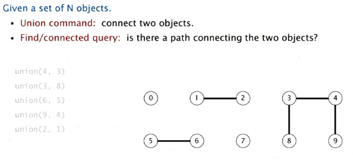
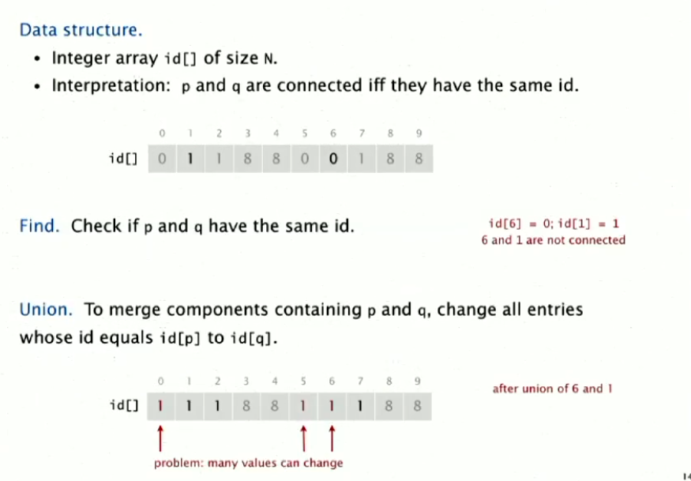
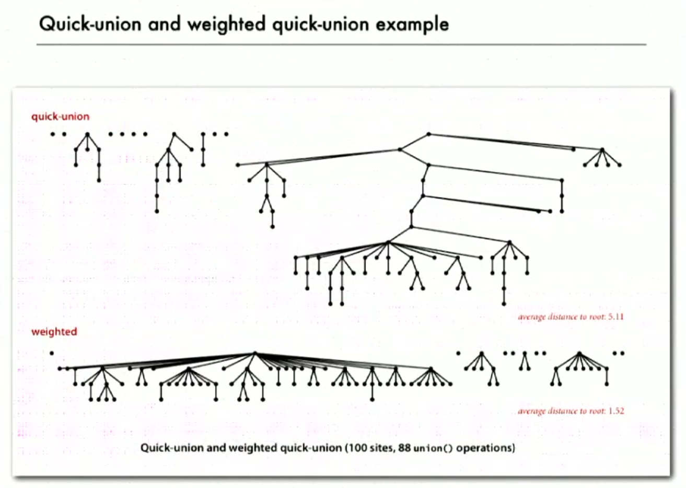
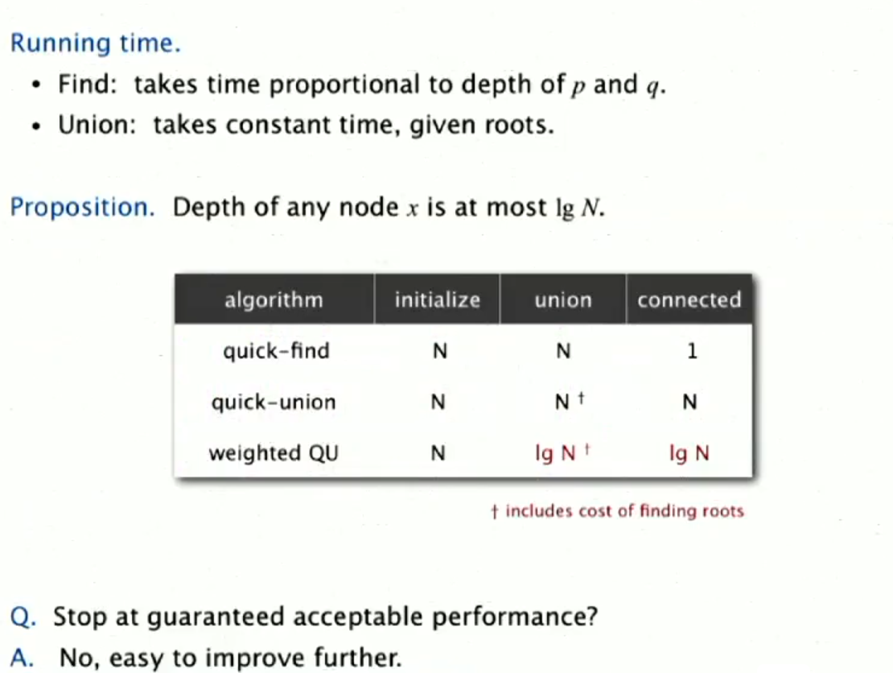
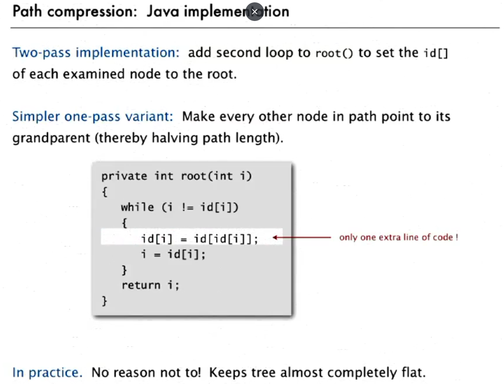
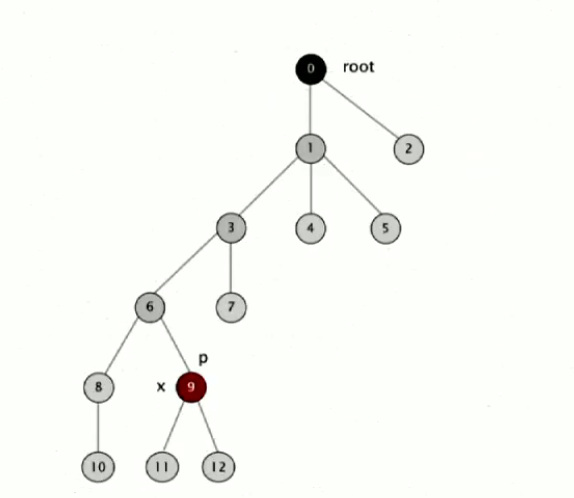
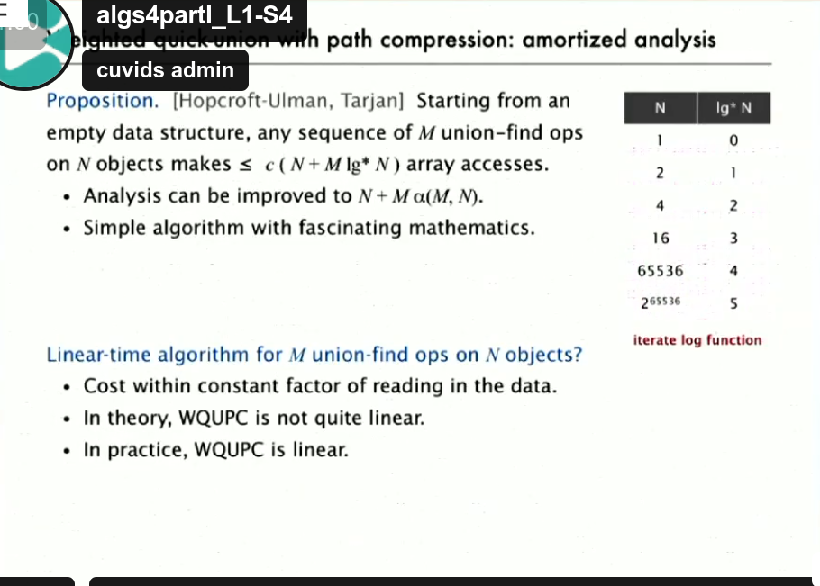
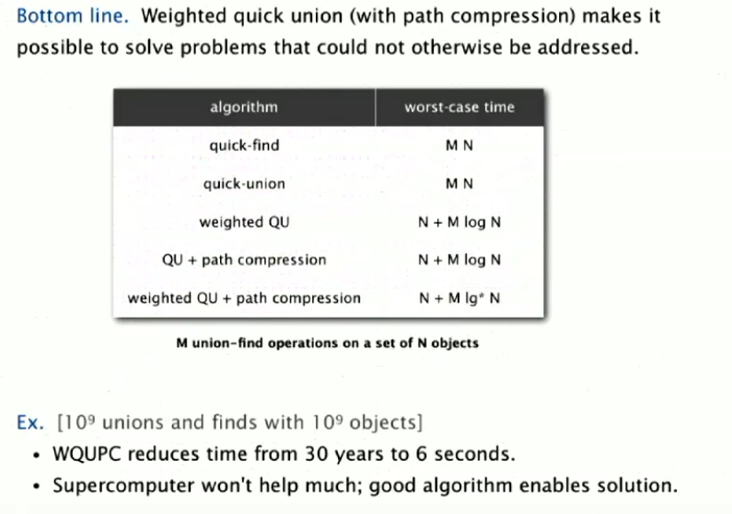

<h1>Union Find</h1>

<h2>Vamos pensar em objetos do mundo real, como pessoas em redes sociais, por exemplo. Agora, 
abstraímos e representamos cada pessoa por um número inteiro. Feito isso, usamos um array 
para "desenhar" o sistema de simulação de conexão entre esses objetos.
</h2>

<h1>QuickFind</h1>
<h2>
 - Inicialmente, cada elemento terá sua própria posição no array, como: array = {0,1,2,3,4,5,6}. (Reflexivo: cada elemento começa apontando para si mesmo.)
 - Para saber se dois elementos fazem parte do mesmo componente (conjunto), verificamos se ambos apontam para o mesmo elemento. Para isso, usamos o método connected(p, q), que testa se array[p] == array[q]. Se for true, então estão conectados (Simétrico: se p está conectado a q, então q está conectado a p).
 - No caso de connected(p, q) ser false, usamos o método union(p, q) para conectá-los, fazendo ambos apontarem para o mesmo elemento. (Transitivo: se p está conectado a q e q está conectado a r, então r está conectado a p.)
</h2>

<h2>Observações: O método find é rápido, mas o union pode ser muito demorado para um N muito grande. Isso ocorre porque precisamos percorrer todo o array, alterando cada elemento do componente para apontar para o mesmo elemento.
</h2>

<h1>QuickUnion</h1>
<h2>
- Union:eu tenho um método que dado um objeto ele me retorna o root desse objeto(procura usando recursão).
E eu só tenho que comparar se são o mesmo root. Se não são apenas aponto um root para outro.
- Find: se torna lento nesse caso. Você vai ter arvores longas e magras.

</h2>
<h1>Improvements:</h1>
 <h2>1. Pesos(see code: WeightedQU.java)

 - Evitar árvores altas e magras;
 - keep track of size of each tree;
 - unir a árvore menor na maior, nunca o contrário(garante que a árvore se expanda lateralmente)
   </h2>

<h2><i>Complexidade:</i></h2>
 <h2>
A complexidade de QuickFind é: 
 - O(1) para connected
 - O(N) para union

A complexidade de QuickUnion é:

- O(N) tanto para union quanto para connected

Quando aplicamos a melhoria de pesos, a complexidade melhora para O(lg N).

Prova:

<b>O que eu quero provar?</b>
<h2>
Que union tem um custo de O(lg N) depois da melhoria. Entretanto, depois de analizar o código é verificado que o método para encontrar o root é 
um processo dominante. Portanto, agora eu quero fazer que o root seja O(lg N) já que ele
é o processo mais custoso.
Para que isso aconteca a distância de qualquer nó para a raiz deve ser, NO MÁXIMO, lg N.
Então:
- digamos que eu tenha o pior caso, ou seja, o nó mais extremo de uma árvore T1 com distância r da root;
- distância vai aumentar em 1 a cada operaćão de union desde que |T2|>=|T1|;
- e nesse caso, a resultante T3 vai ser pelo menos o dobro de tamanho de T1(|T3| >= 2 x|T1|);
- e esse processo se repete, no máximo, lg N vezes;

A complexidade da distancia: O(d) =O(r + lg N) que simplificada: O(d) = O(lg N)
</h2>

<h2>2. Path compression</h2>

<h1>Summary:</h1>

