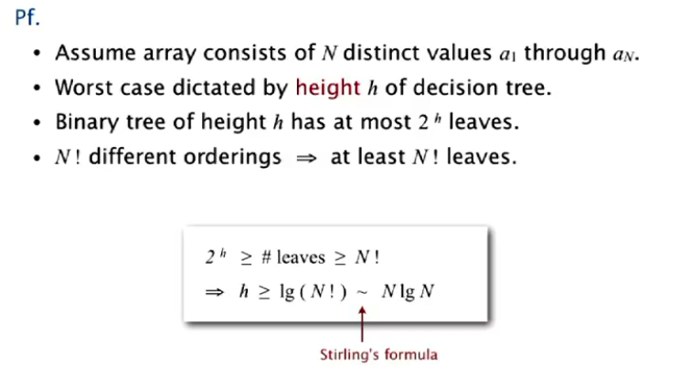

# MergeSort

## What is it?

Frequently, we need to sort and organize data. MergeSort is an algorithm that does this using a 
"divide and conquer" approach. For example, if we have an array, it will divide it into smaller arrays, sort them, 
and then reassemble them, resulting in a sorted array.

## How is it?
"Sort" to order and "Merge" to combine. As for implementation, we have two options: top-down and bottom-up. 
They do the same thing but differ in some details:

### Top-Down (recursive)

Time complexity is driven by the recursive splitting and merging process. At each level of recursion, you split the 
array in half, which results in a height of 𝑁 log N levels, and each level requires 𝑂(𝑁) work to merge the 
sub-rrays. This gives the total complexity of 𝑂(𝑁 log 𝑁).

- The array is recursively divided in half until only 1 element remains;
- Then, it backtracks, sorting and grouping the subarrays into sizes of 2, 4, 6, 8...;
- Finally, we end up with a sorted array.

#### Example:

array = [38, 27, 43, 3, 9, 82, 10]

**Initial division:**
- [38, 27, 43, 3] and [9, 82, 10]

**Recursive division until individual elements:**
- [38, 27], [43, 3], [9, 82], [10]
- [38], [27], [43], [3], [9], [82], [10]

**Merging and sorting:**
- First, adjacent subarrays are merged:
    - [27, 38], [3, 43], [9, 10, 82]
- Next, merge the subarrays:
    - [3, 27, 38, 43], [9, 10, 82]

**Final merge:**
- [3, 9, 10, 27, 38, 43, 82]

**Trace of results:**

### Bottom-Up (iteratively)

Time complexity is similar because it still involves merging at each level, but here the merging is done 
iteratively. The process is still O(NlogN) because the merging stages are similar to the recursive approach.

- The array is initially treated as individual elements (size 1);
- Sub-arrays of size 2, 4, 8, etc., are gradually merged until the entire array is sorted;
- No recursion is involved; this is an iterative process.

#### Example:

array = [38, 27, 43, 3, 9, 82, 10]

**Initial array:**
- [38, 27, 43, 3, 9, 82, 10]

**Step 1: Merge adjacent sub-arrays of size 1 (single elements):**
- [38], [27], [43], [3], [9], [82], [10]

**Step 2: Merge subarrays of size 2:**
- [27, 38], [3, 43], [9, 82], [10]

**Step 3: Merge subarrays of size 4:**
- [3, 27, 38, 43], [9, 10, 82]

**Step 4: Final merge (subarrays of size 8):**
- [3, 9, 10, 27, 38, 43, 82]

**Final sorted array:**
- [3, 9, 10, 27, 38, 43, 82]

**Trace of results:**

## Sorting Computational Complexity

Computational complexity is a framework that helps us understand the efficiency of algorithms. It includes:

- **Upper Bound**: The maximum guaranteed cost of an algorithm (e.g., MergeSort has a cost proportional to \(N \log N\)).

- **Lower Bound**: The minimum cost required for any algorithm to solve the problem (i.e., when there is no 
better algorithm).

For sorting, we can use a **Decision Tree** as a model, where:
- Each node represents a comparison.
- The leaves represent all possible orderings of the data;

The relationship  gives us useful information:

- height of tree = worst-case number of compares;
- at least one leaf for each possible ordering;

$$N \log N < \text{leaves} < 2^h$$
  

## Trade-off

Advantages:

- Guaranteed time complexity: N lg N in all cases(worst,best and average);
- because of the divide and conquer it's easy to parallelize;

Disadvantages:
 
- Space consumption - auxiliary memory of O(N);
- less efficient for small sets(Insertion is better): overhead of recursive
calls and temporary array management;
-  Not Cache-Friendly: MergeSort creates temporary arrays during the merging process to hold subarrays, 
requiring data to be copied back and forth between the temporary and original arrays. This results 
in *non-local memory access*, meaning elements are often accessed in a scattered, non-sequential manner
in memory. This contradicts the concept of caching, which relies on accessing data that is physically 
close to the CPU to optimize performance.

## comparaćão com outros algorithmos

