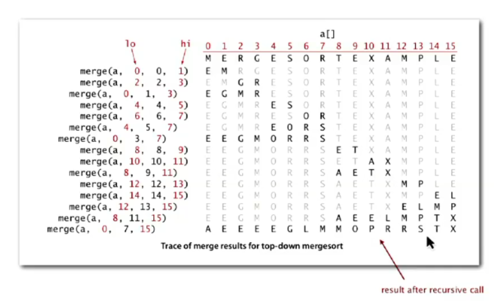
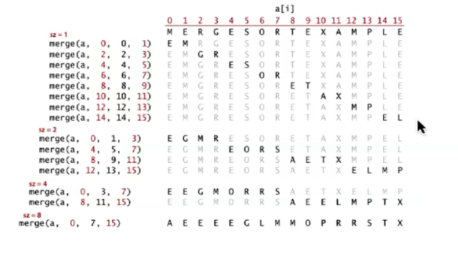

# MergeSort

## What is it?

Frequently, we need to sort and organize data. MergeSort is an algorithm that does this using a 
"divide and conquer" approach. For example, if we have an array, it will divide it into smaller arrays, sort them, 
and then reassemble them, resulting in a sorted array.

## How is it?
"Sort" to order and "Merge" to combine. As for implementation, we have two options: top-down and bottom-up. 
They do the same thing but differ in some details:

### Top-Down (recursive)
- The array is recursively divided in half until only 1 element remains;
- Then, it backtracks, sorting and grouping the subarrays into sizes of 2, 4, 6, 8...;
- Finally, we end up with a sorted array.

#### Example:

array = [38, 27, 43, 3, 9, 82, 10]

**Initial division:**
- [38, 27, 43, 3] and [9, 82, 10]

**Recursive division until individual elements:**
- [38, 27], [43, 3], [9, 82], [10]
- [38], [27], [43], [3], [9], [82], [10]

**Merging and sorting:**
- First, adjacent subarrays are merged:
    - [27, 38], [3, 43], [9, 10, 82]
- Next, merge the subarrays:
    - [3, 27, 38, 43], [9, 10, 82]

**Final merge:**
- [3, 9, 10, 27, 38, 43, 82]

**Trace of results:**

### Bottom-Up (iteratively)
- The array is initially treated as individual elements (size 1);
- Subarrays of size 2, 4, 8, etc., are gradually merged until the entire array is sorted;
- No recursion is involved; this is an iterative process.

#### Example:

array = [38, 27, 43, 3, 9, 82, 10]

**Initial array:**
- [38, 27, 43, 3, 9, 82, 10]

**Step 1: Merge adjacent subarrays of size 1 (single elements):**
- [38], [27], [43], [3], [9], [82], [10]

**Step 2: Merge subarrays of size 2:**
- [27, 38], [3, 43], [9, 82], [10]

**Step 3: Merge subarrays of size 4:**
- [3, 27, 38, 43], [9, 10, 82]

**Step 4: Final merge (subarrays of size 8):**
- [3, 9, 10, 27, 38, 43, 82]

**Final sorted array:**
- [3, 9, 10, 27, 38, 43, 82]

**Trace of results:**

## Complexidade (tempo e espaćo)

## Trade-off

## comparaćão com outros algorithmos

