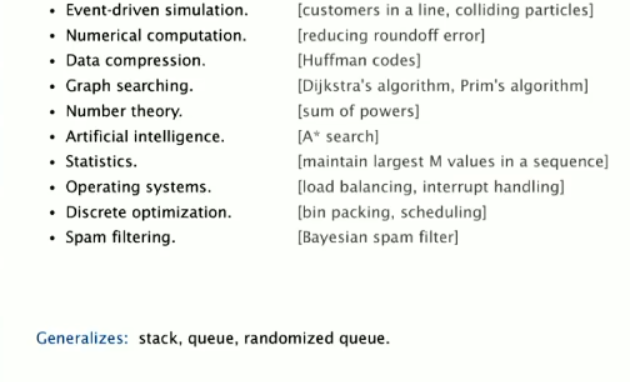

# API and Implementations

## Priority Queue (Abstraction)

The priority queue has the same concept as a regular queue, but with a difference in the item removal criteria.
Instead of removing the first inserted item, we remove the one with the highest (or lowest) priority.

**Example:**
If we have a fixed-size queue M and want to isolate the largest elements from an input N, we will only want to place 
the largest elements read so far in the queue. The main purpose of a priority queue is to ensure that the highest 
priority element is always available for removal first.

## Implementations (ways to implement the abstraction/idea)

### Example: Isolating the largest elements M from a large input N

1. **Sorting**:
    - The approach of **sorting** the elements has a time complexity of **\(O(N \log N)\)**, which is efficient in 
terms of time.
    - **Problem**: We do not have enough space to store all the elements, so the full sorting may not be feasible, 
especially if \(N\) is very large.

2. **Elementary PQ**:
    - **Performance Problem**: The elementary implementation of a priority queue is **very slow**. It requires
**\(O(N)\)** to insert and remove elements, as each insertion and removal operation requires traversing the entire 
list to find the appropriate spot.
    - **Complexity**: For each new element, it would require **\(M \times N\)** operations, which is **inefficient**.
    - **Details**: For each new element inserted, you need to:
        - **Traverse the entire list** to find the appropriate position.
        - **Remove the smallest** element to ensure that the number of elements \(M\) is maintained, adjusting the 
**range of \(M\)**.

3. **Binary Heap(Binary tree)**: We use a tree with the smallest element at the root(min-Heap). Since we want the M largest 
elements from an input N, when a new element enters, we directly compare it with the root.
We can also think about the differences about time when we keep the tree ordered, the insert and remove operations are 
O(log M) You will spend more time, add some overhead, but the search will be more effective.

### Key Points:
Binary Heap efficiently manages the top M elements.

The heap operations (insert and remove) are logarithmic (O(log M)).

While maintaining the heap's order incurs some overhead, it significantly improves the efficiency of retrieving 
the largest (or smallest) elements.

## API

## Use cases

