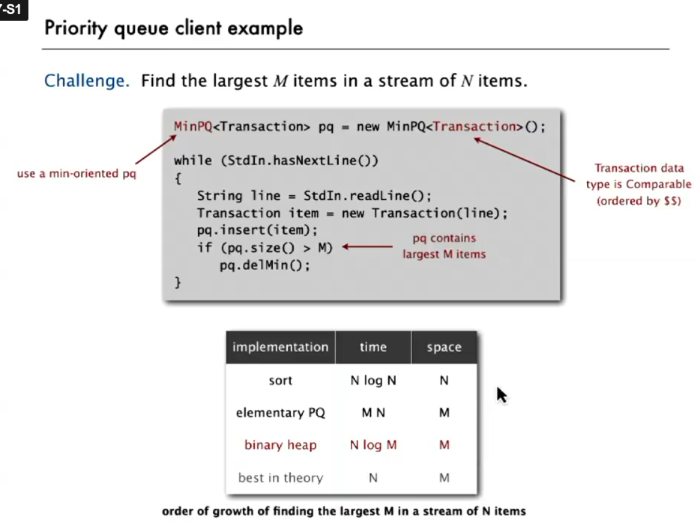
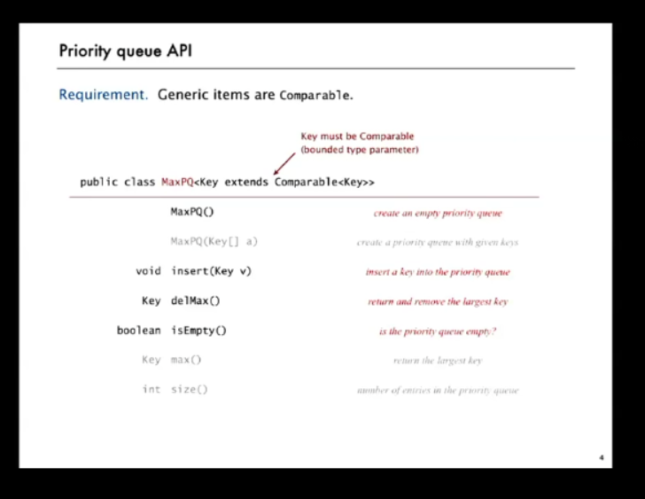
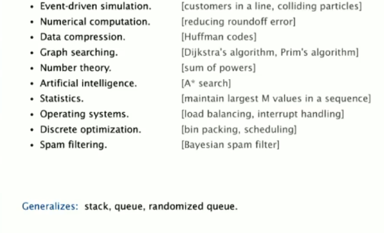

# API and Implementations

## 1. Priority Queue 

The priority queue has the same concept as a regular queue, but with a difference in the item removal criteria.
Instead of removing the first inserted item, we remove the one with the highest (or lowest) priority.

**Example:**
If we have a fixed-size queue M and want to isolate the largest elements from an input N, we will only want to place 
the largest elements read so far in the queue. The main purpose of a priority queue is to ensure that the highest 
priority element is always available for removal first.

## Implementations 

### Example: Isolating the largest elements M from a large input N

1. **Sorting**:
    - The approach of **sorting** the elements has a time complexity of **\(O(N \log N)\)**, which is efficient in 
terms of time.
    - **Problem**: We do not have enough space to store all the elements, so the full sorting may not be feasible, 
especially if \(N\) is very large.

2. **Elementary PQ**:
    - **Performance Problem**: The elementary implementation of a priority queue is **very slow**. It requires
**\(O(N)\)** to insert and remove elements, as each insertion and removal operation requires traversing the entire 
list to find the appropriate spot.
    - **Complexity**: For each new element, it would require **\(M \times N\)** operations, which is **inefficient**.
    - **Details**: For each new element inserted, you need to:
        - **Traverse the entire list** to find the appropriate position.
        - **Remove the smallest** element to ensure that the number of elements \(M\) is maintained, adjusting the 
**range of \(M\)**.

3. **Binary Heap(Binary tree)**: We use a tree with the smallest element at the root(min-Heap). Since we want the M 
largest elements from an input N, when a new element enters, we directly compare it with the root.
We can also think about the differences about time when we keep the tree ordered, the insert and remove operations are 
O(log M) You will spend more time, add some overhead, but the search will be more effective.

### Key Points:
Binary Heap efficiently manages the top M elements.

The heap operations (insert and remove) are logarithmic (O(log M)).

While maintaining the heap's order incurs some overhead, it significantly improves the efficiency of retrieving 
the largest (or smallest) elements.



## API



## Use cases



# 2. Binary Heap


The structure we will use to implement the Binary Heap is an array, meaning each object will have an
index instead of pointers. This array will implement the idea of a **priority queue**: "always remove the element
with the highest priority" – the priority will be defined in the implementation.

---

### Propositions:
- Binary tree: empty OR node with links to left and right;
- Complete tree: perfect balanced - excpt for bottom level;
- Property: height of complete tree with N nodes is lg N: 
  - **Proof:** height only increases when n is a power of 2.

- **Indices:** How to traverse the levels of the tree?  
  Regardless of the organization criteria of the tree, if `k` is the parent, the children will have 
- indexes: `2k` and `2k + 1`.  
  The same applies to children accessing the parent: if the child is `k`, then the parent is `k / 2`.

- **Object values:** Comparison
   - **Min-heap:** children will always be `>=` the parent
   - **Max-heap:** children will always be `<=` the parent

---

### Adding elements:

When I add an element, I do it at the **end of the queue** and use `swim` to rearrange the tree – if needed.


```
private void swim(int k){
    while (k > 1 && less(k,k/2)){
        exch(k,k/2);
        k = k/2;
    }
}

private Key add(Key x){
    pq[++N]= x;
    swim[N];   
}

```
---

### Removing elements:

By definition of a priority queue, I will always **remove the root** and place the last element in the queue at the root.

I have no guarantee that the direct children of the root would be good candidates.  
Moving the last element to the top **modifies the content**, but **maintains the complete structure of the tree** 
(no holes), which is essential to ensure efficiency.

After that, the `sink` method will be used to rearrange the correct positions.  
(*When the boss leaves, you throw someone random in and let the system reorganize itself – `sink`*)
```
public void sink(int k){
    while(2*k <=N){
        int j = 2 * k;
        if(j < N && less(j, j+1)) j++;
        exch(k,j);
        k=j;
    }
}

public Key delMax() {
    Key max = pq[1];
    exch(1, N--);     // <-- linha importante
    sink(1);
    pq[N+1] = null;   // <-- evita loitering
    return max;
}
```


> - Use immutable keys;
> - Exception if tries to remove from an empty pq;
> - Do not expose the capability to the client: PrioriteQueue has a fixed and e extensible pq;
> - Default: pq it will be natural order. Otherwise, the client needs to specify 
> reserve order on the comparator: 
> 
> PriorityQueue<Integer> maxPq = new PriorityQueue<>(Comparator.reverseOrder());

---

Try it here: https://www.cs.usfca.edu/~galles/visualization/Heap.html

