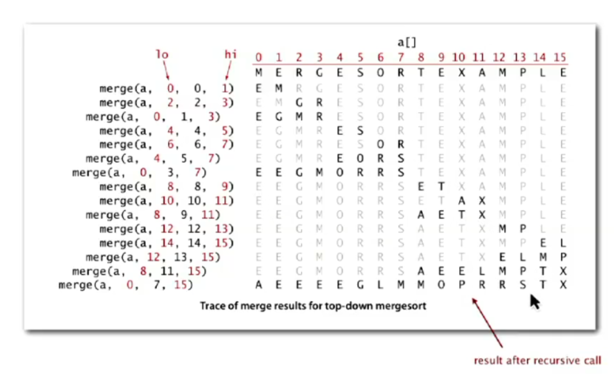
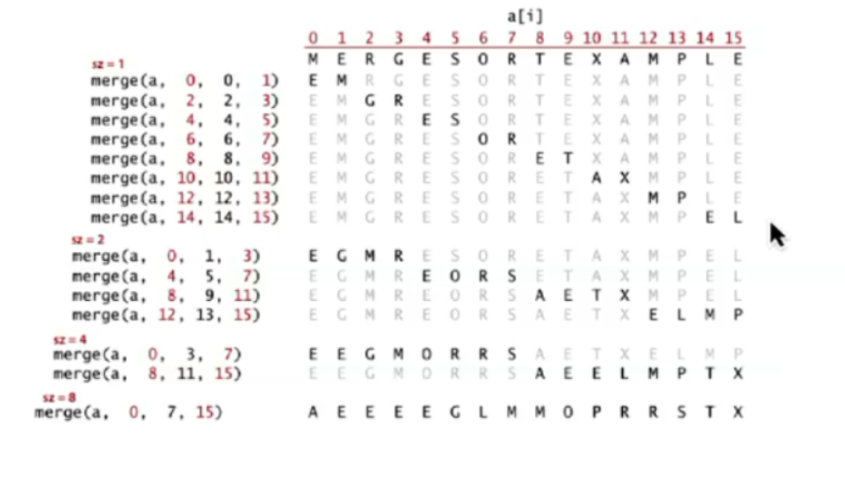
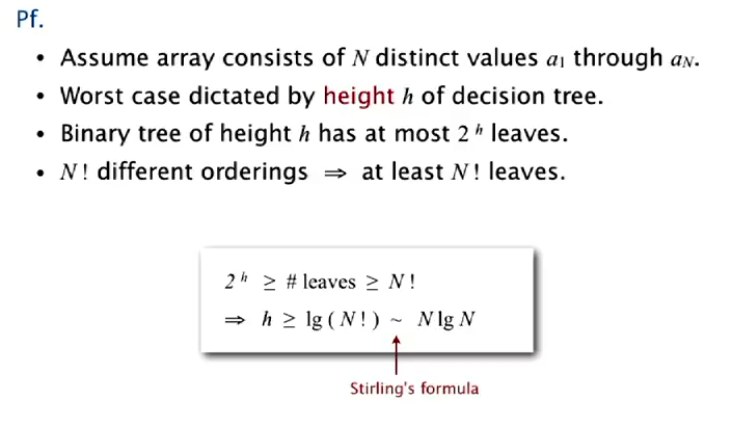

# MergeSort

A concise overview of the theoretical efficiency limits of comparison-based sorting algorithms, using MergeSort to illustrate key concepts in computational complexity.

---

## Objective

**Goal:** Establish the upper and lower bounds for the number of comparisons required to sort $N$ elements, and demonstrate that MergeSort is optimal in this context.

Sorting and organizing data is a fundamental task. MergeSort accomplishes this using a **divide and conquer** strategy:
- Recursively split the array into smaller subarrays
- Sort each subarray
- Merge the sorted subarrays to produce a fully sorted array

---

## MergeSort Approaches

"Sort" means to order; "Merge" means to combine. There are two main implementations:

- **Top-Down (recursive)**
- **Bottom-Up (iterative)**

Both achieve the same result, but differ in their process.

### Top-Down (Recursive)

- The array is recursively divided into halves until only one element remains
- The algorithm then backtracks, merging and sorting the halves
- The result is a sorted array

**Time Complexity:**
- Each level of recursion splits the array in half (log $N$ levels)
- Each level requires $O(N)$ work to merge subarrays
- **Total complexity:** $O(N \log N)$

#### Example

Given: `array = [38, 27, 43, 3, 9, 82, 10]`

**Initial division:**
- [38, 27, 43, 3] and [9, 82, 10]

**Recursive division until individual elements:**
- [38, 27], [43, 3], [9, 82], [10]
- [38], [27], [43], [3], [9], [82], [10]

**Merging and sorting:**
- First, adjacent subarrays are merged:
    - [27, 38], [3, 43], [9, 10, 82]
- Next, merge the subarrays:
    - [3, 27, 38, 43], [9, 10, 82]

**Final merge:**
- [3, 9, 10, 27, 38, 43, 82]

**Trace of results:**

### Bottom-Up (Iterative)

- The array is initially treated as individual elements (size 1)
- Subarrays of size 2, 4, 8, etc., are gradually merged until the entire array is sorted
- This is an iterative process with no recursion

**Time Complexity:**
- Similar to the top-down approach, as it involves merging at each level
- **Total complexity:** $O(N \log N)$

#### Example

Given: `array = [38, 27, 43, 3, 9, 82, 10]`

**Initial array:**
- [38, 27, 43, 3, 9, 82, 10]

**Step 1: Merge adjacent sub-arrays of size 1 (single elements):**
- [38], [27], [43], [3], [9], [82], [10]

**Step 2: Merge subarrays of size 2:**
- [27, 38], [3, 43], [9, 82], [10]

**Step 3: Merge subarrays of size 4:**
- [3, 27, 38, 43], [9, 10, 82]

**Step 4: Final merge (subarrays of size 8):**
- [3, 9, 10, 27, 38, 43, 82]

**Final sorted array:**
- [3, 9, 10, 27, 38, 43, 82]

**Trace of results:**

## Sorting Computational Complexity

Computational complexity is a framework that helps us understand the efficiency of algorithms. It includes:

- **Upper Bound**: The maximum guaranteed cost of an algorithm (e.g., MergeSort has a cost proportional to N lg N).

- **Lower Bound**: The minimum cost required for any algorithm to solve the problem (i.e., when there is no 
better algorithm).

For sorting, we can use a **Decision Tree** as a model, where:
- Each node represents a comparison.
- The leaves represent all possible orderings of the data;

The relationship  gives us useful information:

- height of tree = worst-case number of compares;
- at least one leaf for each possible ordering, at least N! leaves

$N \lg N < \text{leaves} < 2^h$

MergeSort is considered optimal in terms of required comparisons because it reaches the theoretical upper and 
lower limits 𝑁 lg 𝑁 for comparison-based algorithms. However, optimality depends on the criterion being 
analyzed, and for memory, for example, it is not the most efficient.

## Trade-off

Advantages:

- Guaranteed time complexity: N lg N in all cases(worst,best and average);
- parallelize: because of the divide and conquer it's easy to parallelize;
- stability: if you want to apply MergeSort twice(first by name and after by age, e.g.) the 
MergeSort won't change the order which already exists in the elements of the same key. 
This, because, when we have left and right elements equals we ALWAYS copy first all the items from
left in that order(pay attention to the code you write); Think about Selection Sort:

[B1, B2, A] results in [A,B2,B1]: that is, it has changed an order that was already correct B1 and B2

Disadvantages:
 
- Space consumption - auxiliary memory of O(N);
- less efficient for small sets(Insertion is better): overhead of recursive
calls and temporary array management;
-  Not Cache-Friendly: MergeSort creates temporary arrays during the merging process to hold subarrays, 
requiring data to be copied back and forth between the temporary and original arrays. This results 
in *non-local memory access*, meaning elements are often accessed in a scattered, non-sequential manner
in memory. This contradicts the concept of caching, which relies on accessing data that is physically 
close to the CPU to optimize performance.

# to do: programming a parallelized mergesort
