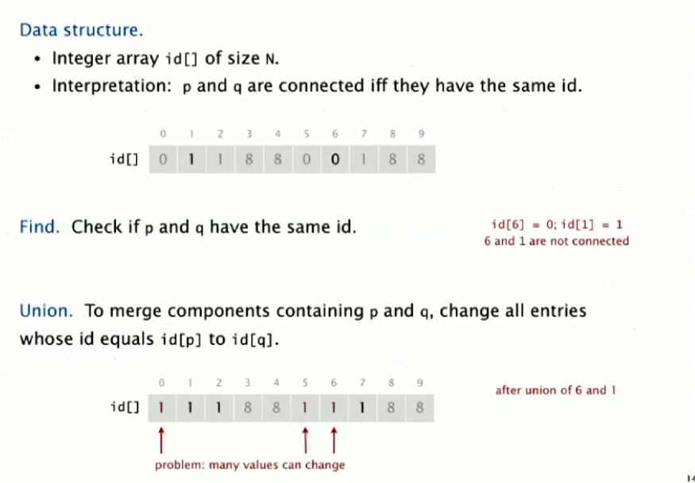
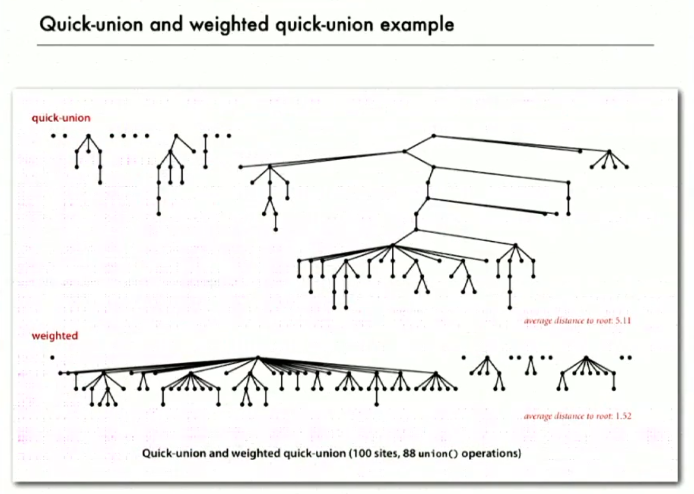
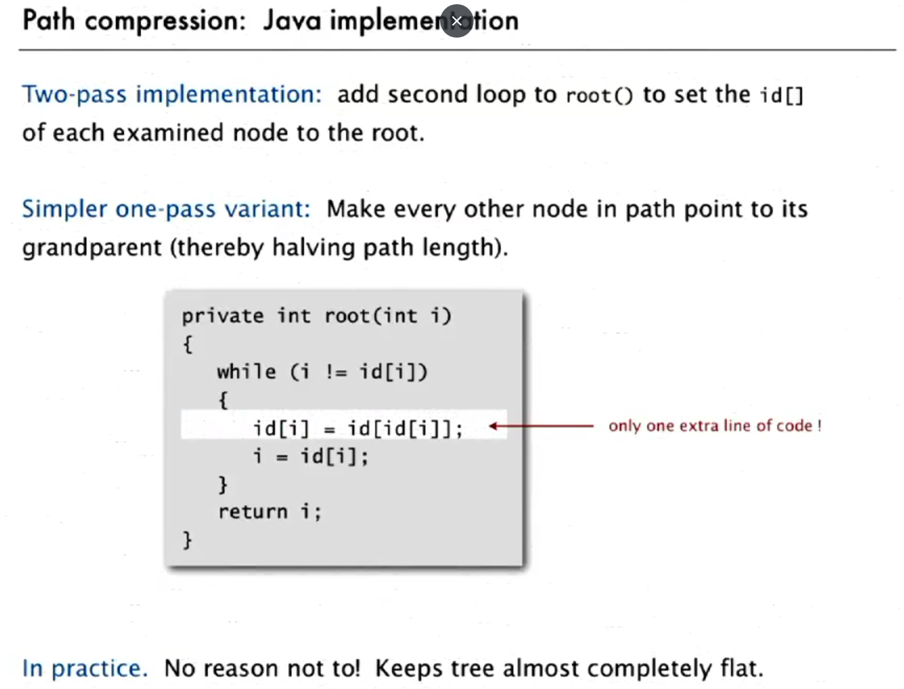
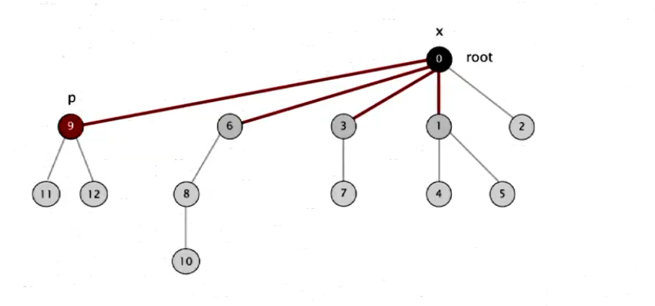
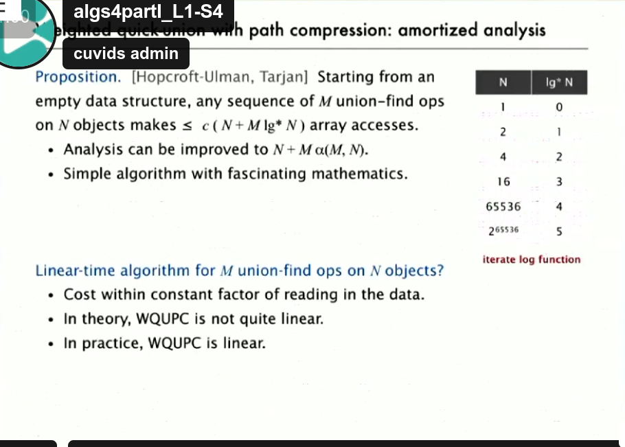
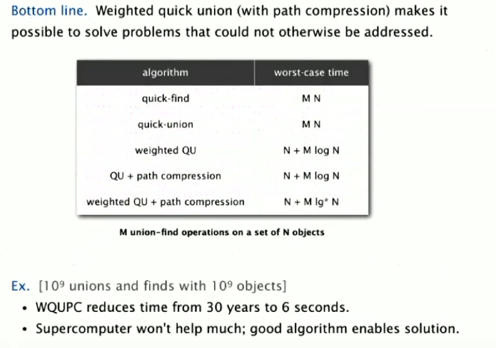

<h1>Union Find</h1>

<h2>Let’s think about real-world objects, such as people in social networks. Now, let’s abstract this and represent each person with an integer. With that done, we use an array to "draw" the connection simulation system between these objects.</h2>

<h1>QuickFind</h1>
<h2>
- Initially, each element has its own position in the array, for example: array = {0, 1, 2, 3, 4, 5, 6}. (Reflexive: each element starts by pointing to itself.)
- To check if two elements belong to the same component (set), we verify if both point to the same element. This is done using the method <code>connected(p, q)</code>, which tests if <code>array[p] == array[q]</code>. If true, they are connected (Symmetric: if p is connected to q, then q is connected to p).
- If <code>connected(p, q)</code> returns false, we use the method <code>union(p, q)</code> to connect them by making both point to the same element. (Transitive: if p is connected to q, and q is connected to r, then r is connected to p.)
</h2>

<h2>Notes: The <code>find</code> method is fast, but the <code>union</code> method can become very slow for a large N. This is because we need to traverse the entire array, updating each element of the component to point to the same root element.</h2>

<h1>QuickUnion</h1>
<h2>
- **Union**: I have a method that, given an object, returns its root (using recursion to search for it). To unite two objects, I just need to compare their roots. If they have different roots, I point one root to the other.
- **Find**: Becomes slower in this case. Long and thin trees can form, which increases the traversal time.
</h2>

<h1>Improvements:</h1>
<h2>1. Weighted Union (see code: <code>algorithms.WeightedQU.java</code>)</h2>
- Avoid creating tall, thin trees.  
- Keep track of the size of each tree.  
- Always attach the smaller tree under the larger tree (this ensures the tree expands laterally).  

<h2><i>Complexity:</i></h2>
<h2>
The complexity of QuickFind is:  
- O(1) for <code>connected</code>  
- O(N) for <code>union</code>  

The complexity of QuickUnion is:  
- O(N) for both <code>union</code> and <code>connected</code>.  

When we apply the weighted improvement, the complexity improves to O(log N).

<b>Proof:</b>
<h2>
<b>What do I want to prove?</b>  
That <code>union</code> has a cost of O(log N) after applying the improvement.  
However, after analyzing the code, it becomes clear that the method to find the root is the dominant process.  
Therefore, I now aim to make the root-finding process O(log N) since it is the most expensive operation.  

To achieve this, the distance from any node to the root must be, at most, log N.  

Let’s analyze:  
- Suppose we have the worst-case scenario, where a node in a tree T1 is at distance r from the root.  
- The distance increases by 1 with each <code>union</code> operation, provided that |T2| >= |T1|.  
- In this case, the resulting tree T3 will be at least twice the size of T1 (|T3| >= 2 × |T1|).  
- This process repeats at most log N times.  

The complexity of the distance:  
O(d) = O(r + log N), which simplifies to O(d) = O(log N).  
</h2>

<h2>2. Path Compression</h2>

<h1>Summary:</h1>

